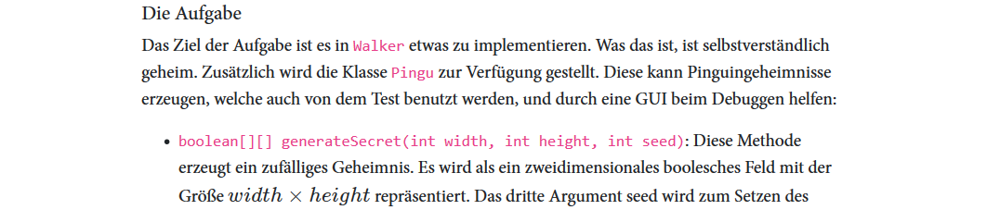
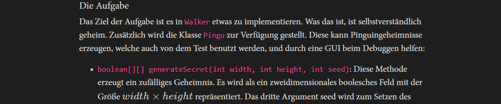

# PublicScripts

Here I will place some of the things I wrote and found useful for myself.

---

## FormalLanguageTools
FormalLanguageTools is a powershell module that allows you to define formal languages and generate words from it. Currently features like checking which rules to apply to get to a certain word are not implemented yet, but you can use it to verify that the rules of your grammar work.

### Usage
``` powershell
"S->aBSc, Ba->aB, Bb -> bB, Bc -> bc" | ConvertTo-FormalLanguageRules |
    New-FormalGrammar | Get-FormalLanguageWords -Iterations 5 | Find-TerminalWord
```

will output this where the first word is the empty word.
```

abc
aabbcc
aaabbbccc
aaaabbbbcccc
aaaaabbbbbccccc
aaaaaabbbbbbcccccc
```

---

# Themes
For browser themes use either greasemonkey to make them permanent or use bookmarklets. I recommend this for instance: https://caiorss.github.io/bookmarklet-maker/

## Artemis White
This doesn't actually change any colors, but it swaps the font, increases its size and centers content to make the excercise page more readable.



Bookmarklet*:
```
javascript:(function()%7Bb%20%3D%20document.body.style%3B%0Ab.transition%20%3D%20%221s%22%3B%0Ab.fontFamily%20%3D%20%22Segoe%20UI%22%3B%0Ab.fontSize%20%3D%20%221.2rem%22%3B%0Ai%20%3D%20document.getElementById(%22programming-exercise-instructions-content%22).style%3B%0Ai.maxWidth%20%3D%20%2250rem%22%3B%0Ai.margin%20%3D%20%22auto%22%3B%7D)()%3B">Artemis White
```


## Artemis Dark


Bookmarklet*:
```
javascript:(function()%7Bb%20%3D%20document.body.style%3B%0Ab.transition%20%3D%20%221s%22%3B%0Ab.fontFamily%20%3D%20%22Segoe%20PUI%22%3B%0Ab.fontSize%20%3D%20%221.2rem%22%3B%0Ab.color%20%3D%20%22%23d4d4d4%22%0Ai%20%3D%20document.getElementById(%22programming-exercise-instructions-content%22).style%3B%0Ai.maxWidth%20%3D%20%2250rem%22%3B%0Ai.margin%20%3D%20%22auto%22%3B%7D)()%3B">Artemis Dark
```

The colors are mostly from VSCode as it already uses a dark theme with well balanced colors.

<sup>* Changed font back to Segoe UI</sup>
